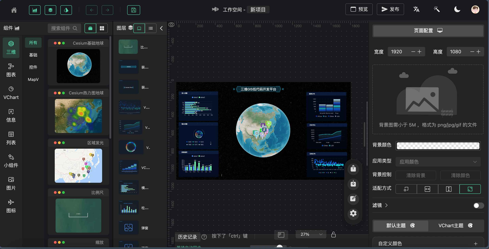
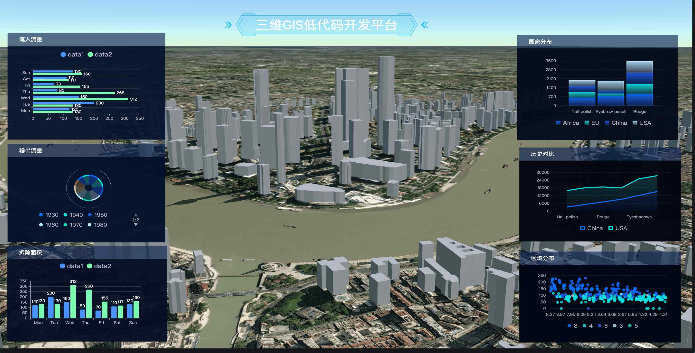

一款Fork自[GoView](https://gitee.com/dromara/go-view)的GIS低代码开发平台，支持快速搭建GIS大屏/看板。

## 示例



<center>工作台</center>


<center>热力地球</center>




<center>白膜</center>


<center>倾斜模型</center>


## 使用

先安装后端服务

当前社区实现的后端项目

- `JAVA` https://gitee.com/MTrun/go-view-serve
- `.NET` https://gitee.com/sun_xiang_yu/go-view-dotnet
- `NODE` https://gitee.com/qwdingyu/led
- `Docker 镜像` https://gitee.com/AHEAD4/go-view-docker
- `GO-goframe` https://gitee.com/bufanyun/go-view-server
- `GO-gin` https://gitee.com/ls1990/go-view-serve


安装依赖

```bash
pnpm install
```

运行

```bash
pnpm run dev 
```

部署

```bash
pnpm run build
```


## 说明

本项目基于 [GoView](httphttps://gitee.com/dromara/go-view)进行二次开发，修改如下：

- 支持三维GIS场景。
- 修改项目名称，商标及其他元数据。


